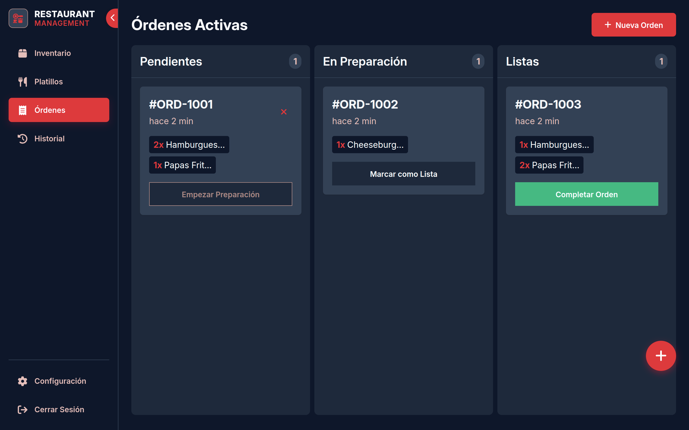
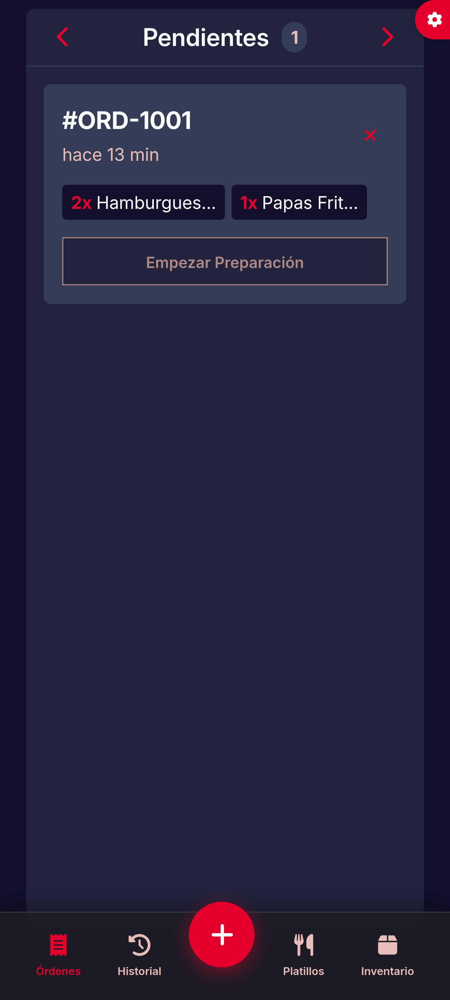
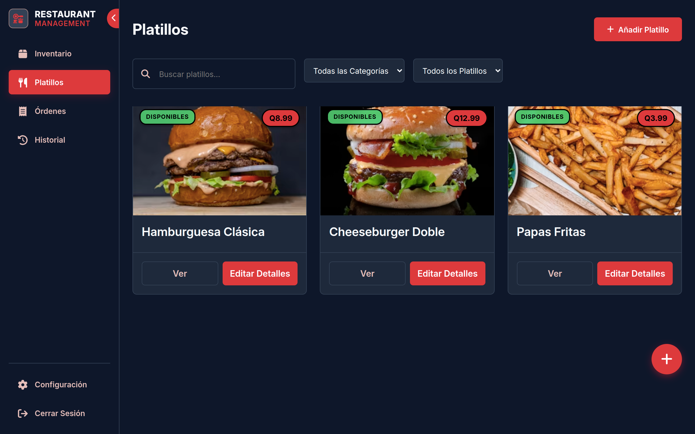
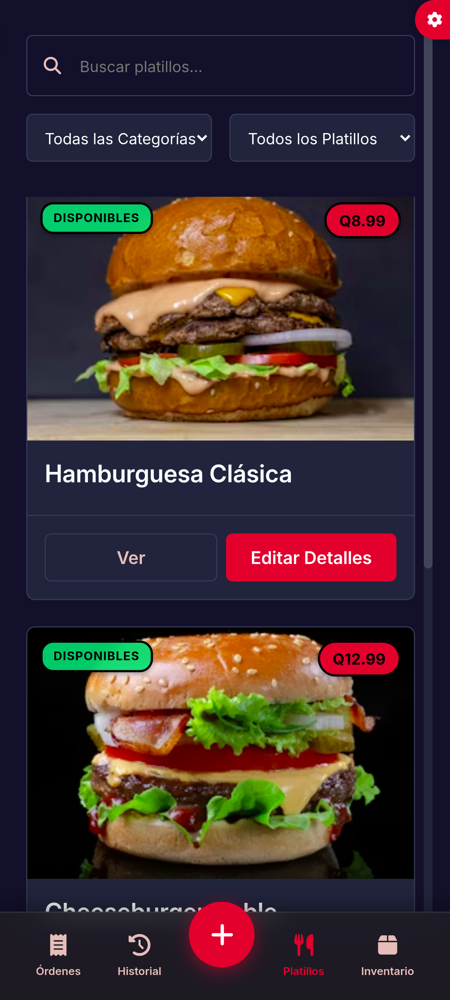
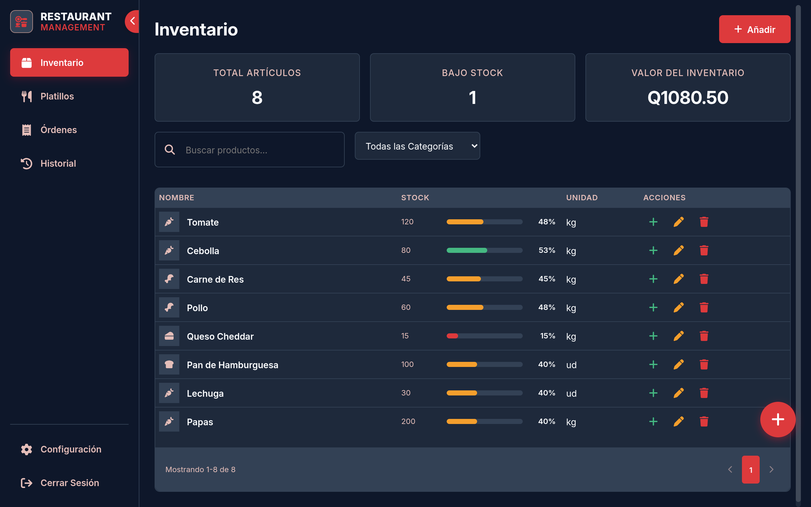
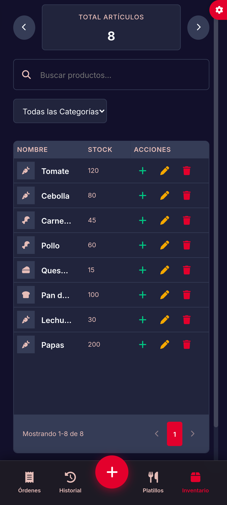
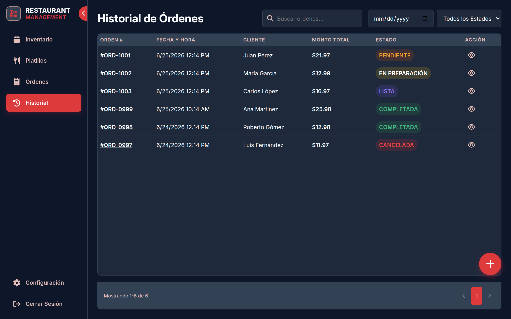
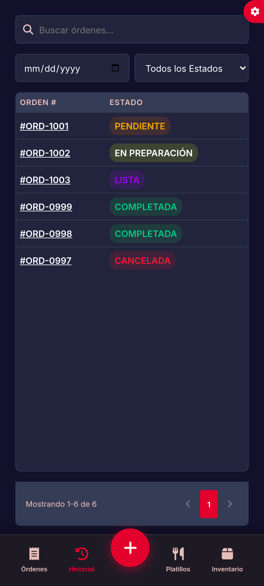
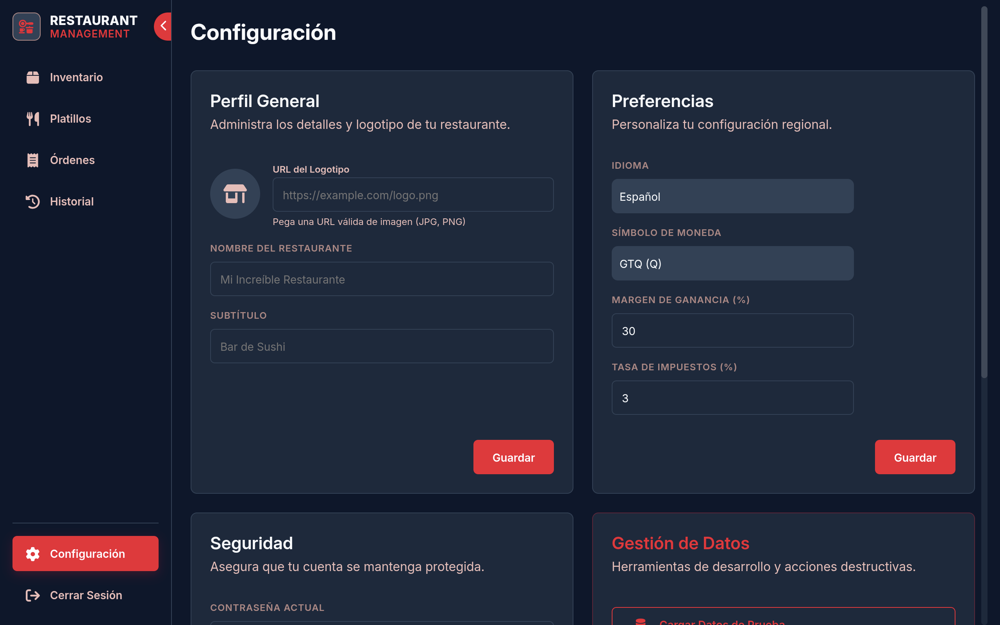
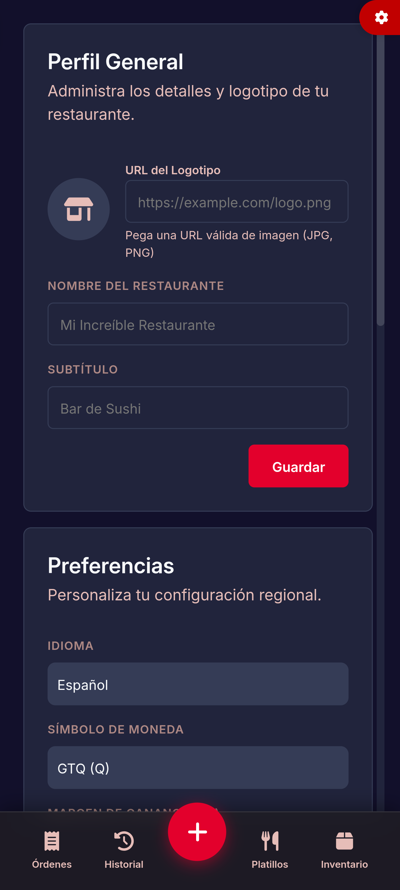

# Restaurant Management POS

**Desarrollado por:** [Randolh](https://github.com/Randolh)

## Descripción del Proyecto
Una moderna y completa aplicación web de **Punto de Venta (POS) y Gestión de Restaurantes**, construida íntegramente con HTML, CSS y Vanilla JavaScript (sin frameworks). Cuenta con una arquitectura *Single Page Application (SPA)* mediante enrutamiento propio, persistencia de datos local, internacionalización dinámica y un diseño fluido y adaptable para cualquier dispositivo (Escritorio, Tablet y Móvil).

Esta herramienta está pensada para agilizar el flujo de trabajo de un restaurante, desde la gestión de ingredientes y creación de platillos, hasta la toma de pedidos y visualización del estado de las órdenes en tiempo real mediante un tablero Kanban interactivo.

## Características Principales
- **Sistema de Punto de Venta (POS):** Toma de órdenes rápida y estructurada adaptada a pantallas táctiles y de escritorio.
- **Tablero Kanban de Órdenes:** Visualización de pedidos con columnas de estado (Nueva, En preparación, Lista) arrastrables o gestionables por clics.
- **Gestor de Inventario y Platillos:** Creación y costeo de recetas calculando automáticamente el margen de ganancia e impuestos.
- **Internacionalización y Monedas:** Soporte dinámico para múltiples idiomas (Español/Inglés) y varios tipos de divisas, modificables desde los ajustes.
- **Persistencia Local y Dummy Data:** La información se almacena localmente y permite inyectar datos de prueba desde los ajustes para una rápida demostración.
- **Diseño Premium y Transiciones:** Uso de animaciones de página suaves, estados de carga y modales interactivos.

## Capturas de Pantalla

A continuación, algunas capturas de la aplicación en funcionamiento tanto en versión de escritorio como en versión móvil:

### Tablero de Órdenes (POS y Kanban)
<p align="center">
  
  
</p>

### Gestión de Platillos
<p align="center">
  
  
</p>

### Inventario de Ingredientes
<p align="center">
  
  
</p>

### Historial de Órdenes
<p align="center">
  
  
</p>

### Ajustes Generales
<p align="center">
  
  
</p>

## Cómo ejecutar el proyecto localmente

Este proyecto utiliza tecnologías web nativas (HTML, CSS y JS), por lo que no requiere de la instalación de dependencias pesadas ni compiladores (como Node/NPM) para funcionar.

Debido al uso de módulos (`type="module"`) en JavaScript, es estrictamente necesario ejecutar la aplicación mediante un servidor local, ya que abrir el `index.html` directamente en el navegador bloqueará los scripts por políticas de seguridad (CORS).

### Opción 1: Usando Python (Terminal)
Si tienes Python instalado, abre tu terminal en la carpeta del proyecto y ejecuta el siguiente comando:
```bash
python3 -m http.server 8000
```
Luego, abre tu navegador y visita `http://localhost:8000`.

### Opción 2: Usando Live Server (VS Code)
1. Abre la carpeta del proyecto en Visual Studio Code.
2. Asegúrate de tener instalada la extensión **Live Server**.
3. Haz clic derecho sobre el archivo `index.html` y selecciona **"Open with Live Server"**.

### Primer Ingreso
Al iniciar la aplicación por primera vez, serás dirigido a la pantalla de **Login** y se te mostrarán las credenciales por defecto (admin@restaurant.com / password123) autocompletadas en el formulario.
