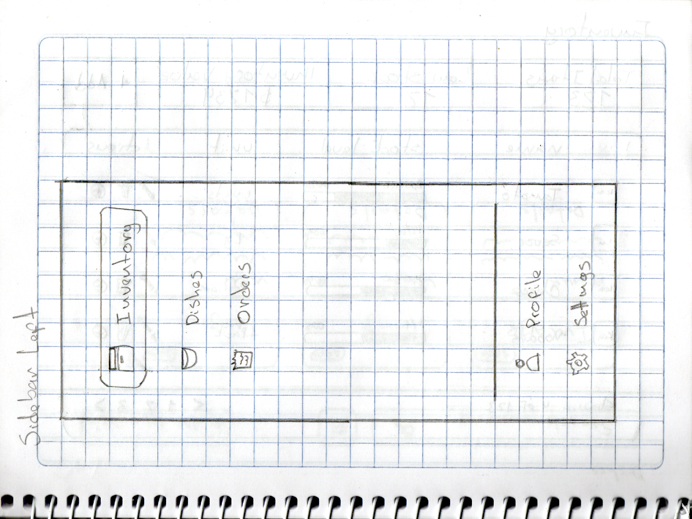
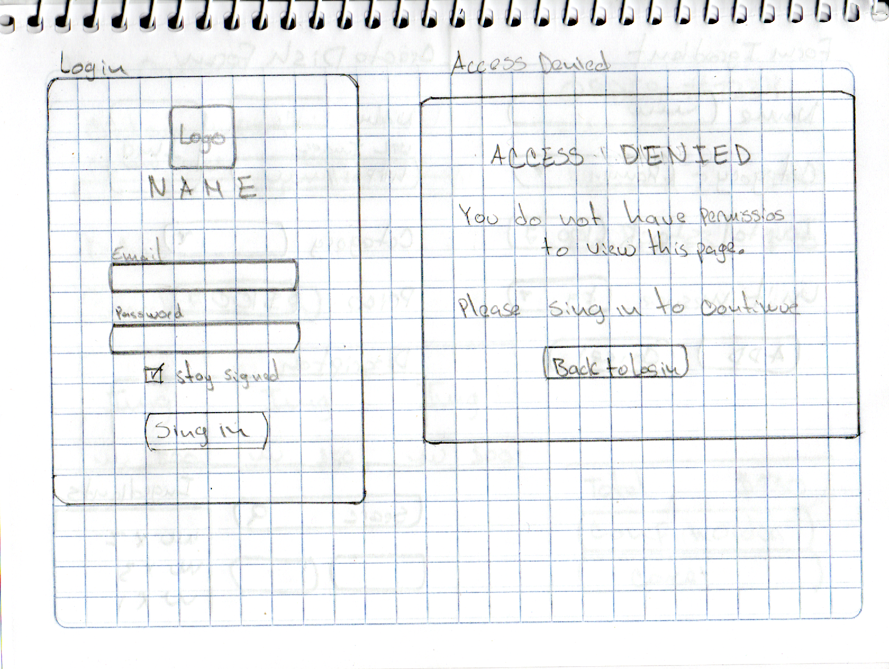
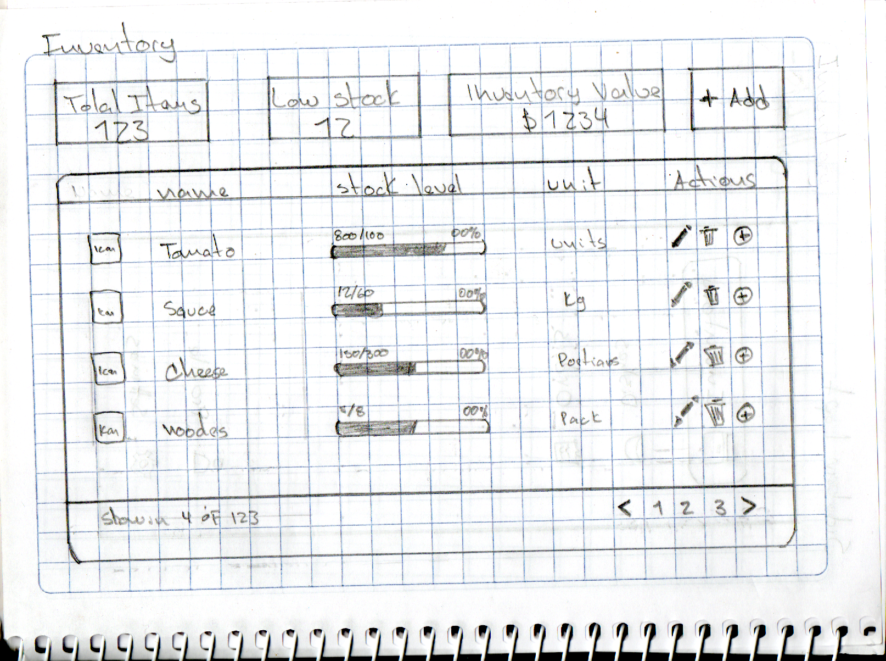
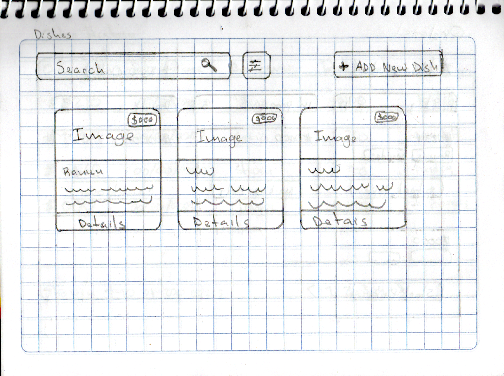
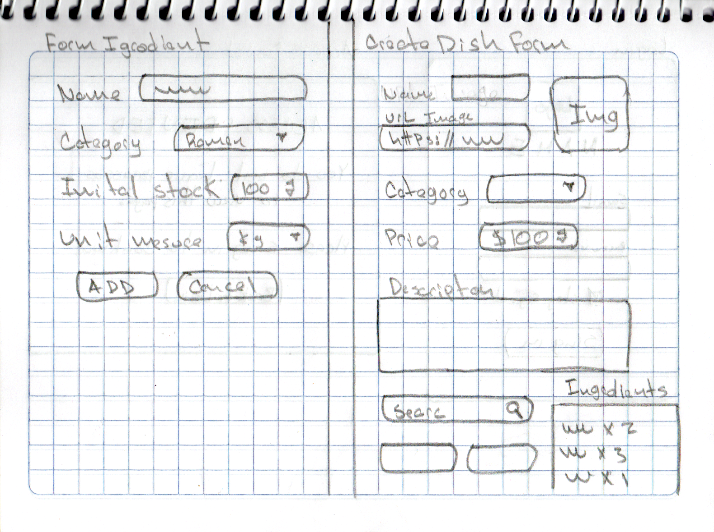
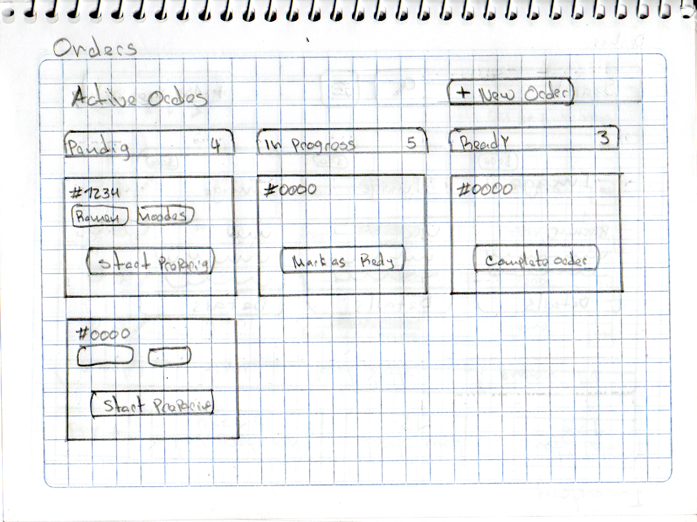
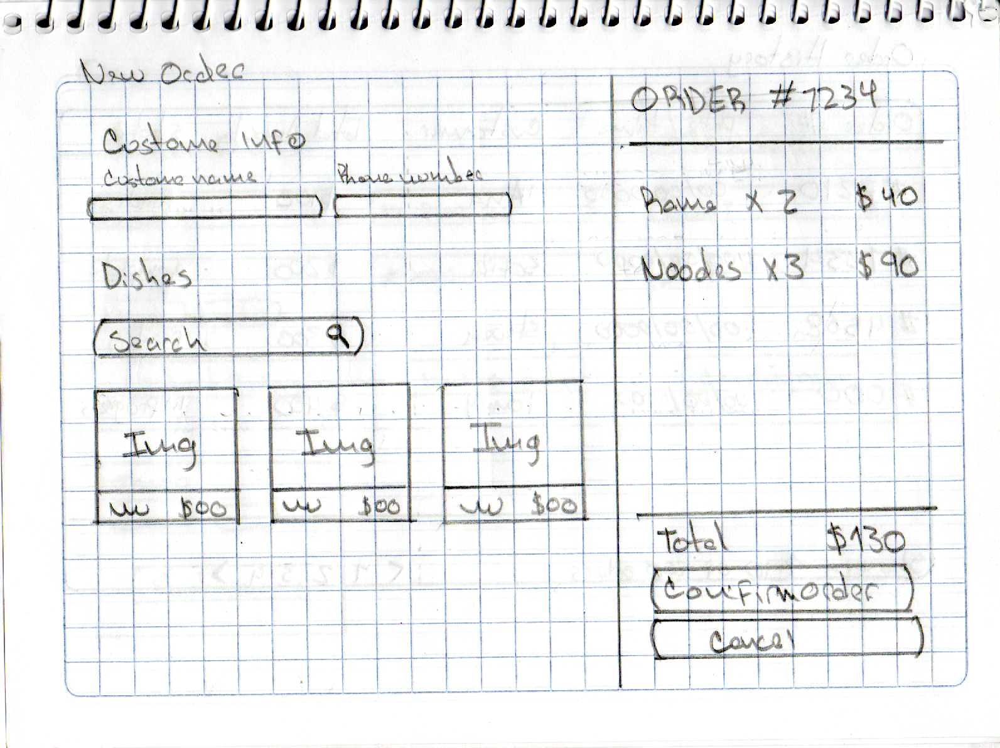
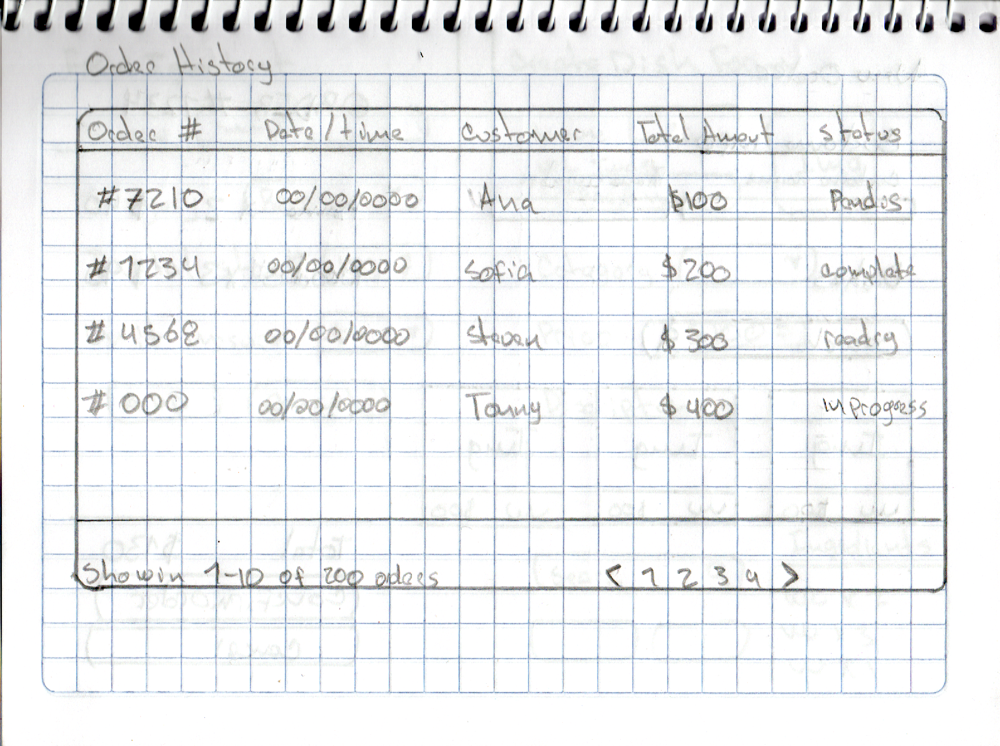

# Documentación de Wireframes - Sistema de Gestión de Restaurante

Este documento detalla la propuesta visual y estructural de la interfaz de usuario (UI) para la aplicación web de gestión del restaurante. Los diseños han sido conceptualizados para cumplir con los requerimientos de administración de inventario, catálogo de platillos y control de pedidos, priorizando una experiencia de usuario (UX) fluida y adaptable (responsive).

## 1. Estructura y Navegación Principal

La aplicación utiliza un esquema de navegación lateral para pantallas de escritorio, el cual deberá transformarse en un menú hamburguesa o barra inferior en dispositivos móviles.

* **Menú de Navegación:** Incluye accesos directos a los módulos centrales: Inventario, Platillos y Pedidos.
* **Opciones Adicionales:** En la sección inferior se alojan los accesos al Perfil del usuario y la Configuración del sistema.

## 2. Autenticación y Control de Acceso

La seguridad y el acceso exclusivo para administradores se maneja mediante una pantalla de inicio de sesión.

* **Login:** Formulario minimalista que solicita correo electrónico y contraseña, con opción para mantener la sesión iniciada.
* **Acceso Denegado:** Modal o pantalla de error clara que indica al usuario cuando no tiene los permisos necesarios o su sesión ha expirado, ofreciendo un botón de retorno seguro al login.

## 3. Módulo de Inventario (Insumos)

Este módulo condensa los ingredientes utilizados en el restaurante.

* **Panel de Indicadores (KPIs):** Muestra el total de artículos, alertas de stock bajo y el valor monetario del inventario.
* **Listado de Insumos:** Tabla detallada que muestra el nombre del insumo, un indicador gráfico (barra de progreso) del nivel de stock actual frente al ideal, la unidad de medida y botones de acción (editar, eliminar, reabastecer).

## 4. Módulo de Platillos

Representa los productos finales comercializados por el restaurante.

* **Catálogo Visual:** Organización basada en tarjetas (cards) que muestran la fotografía del platillo, su precio destacado, título y una breve descripción.
* **Controles:** Barra de búsqueda superior, botón de filtros por categoría y un botón principal para registrar un nuevo platillo.

## 5. Formularios de Registro

Diseños propuestos para la captura y validación de datos tanto de insumos como de platillos.

* **Nuevo Insumo (Izquierda):** Campos para nombre, selección de categoría, ingreso de stock inicial numérico y unidad de medida.
* **Nuevo Platillo (Derecha):** Permite ingresar nombre, URL de la imagen (con un recuadro de vista previa), categoría, precio de venta y descripción. Incluye una sección crítica para construir la receta: un buscador para seleccionar insumos del inventario y definir qué cantidad de cada uno se descuenta al preparar este platillo.

## 6. Módulo de Pedidos

El corazón de la operativa diaria del restaurante, dividido en la gestión activa, creación y revisión histórica.

### 6.1 Gestión de Pedidos Activos

* **Flujo de Trabajo:** Sistema de columnas basado en estados: Pendiente, En Progreso y Listo.
* **Tarjetas de Pedido:** Cada orden muestra su número de identificación, los platillos solicitados y botones de llamada a la acción ("Iniciar Preparación", "Marcar como Listo", "Completar Orden") que mueven la tarjeta a la siguiente columna.

### 6.2 Registro de Nuevo Pedido

* **Distribución en Pantalla Dividida:**
    * **Izquierda:** Captura de datos del cliente (nombre, teléfono) y un buscador visual con tarjetas seleccionables para añadir platillos a la orden.
    * **Derecha (Ticket):** Resumen en tiempo real de la orden. Muestra el número de pedido generado, los platillos agregados con sus respectivas cantidades y subtotales.
* **Cálculo Automático:** Se visualiza el costo total calculado dinámicamente antes de utilizar los botones de confirmación o cancelación.

### 6.3 Historial de Pedidos

* **Tabla de Registro:** Vista estructurada que consolida las ventas pasadas. Expone el número de orden, fecha y hora exacta, nombre del cliente, el monto total cobrado y el estado final del pedido.
* **Paginación:** Controles inferiores para navegar entre múltiples páginas de registros históricos.